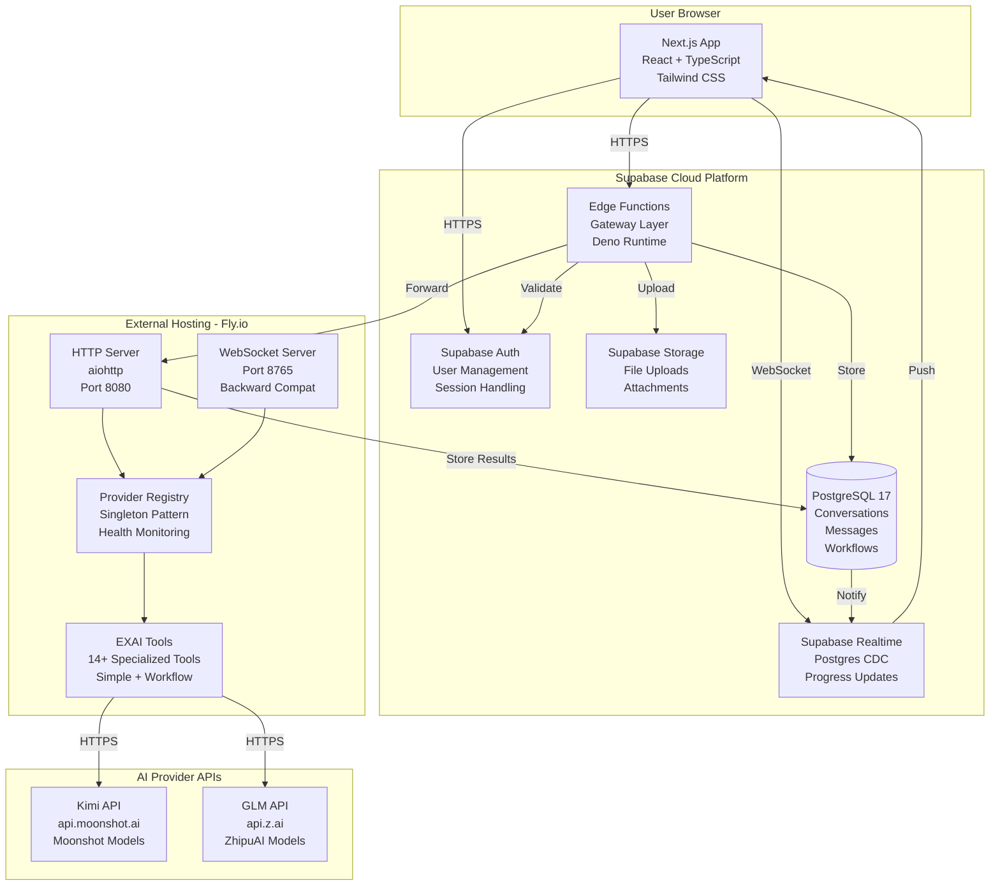
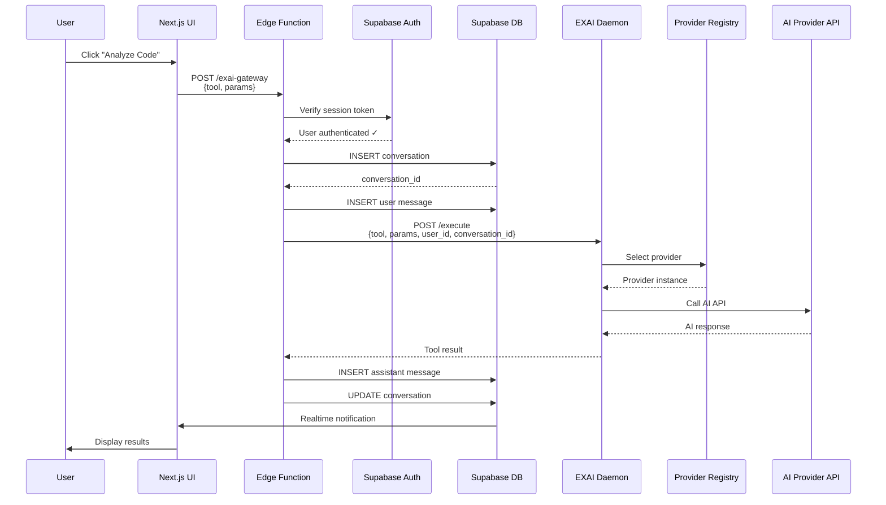
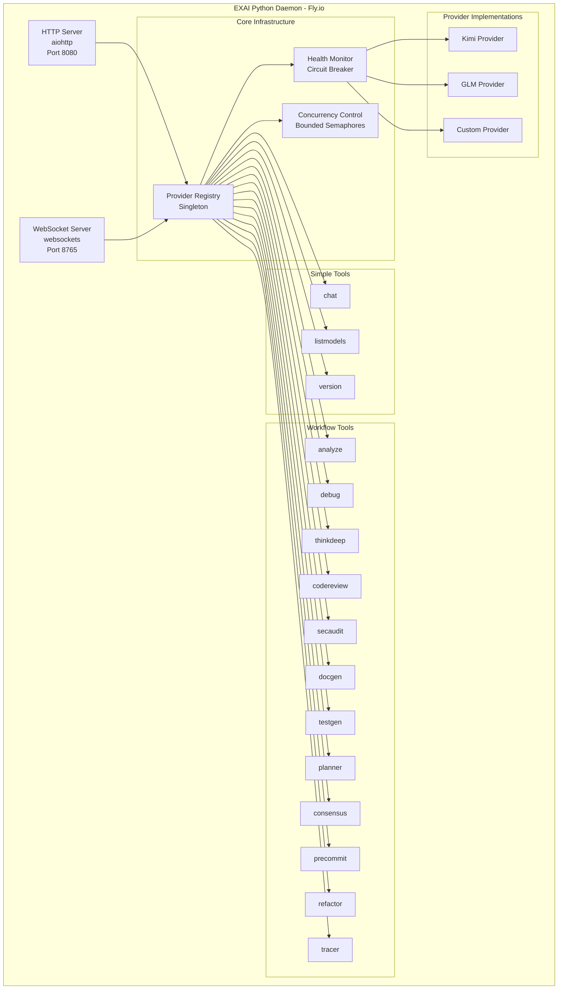
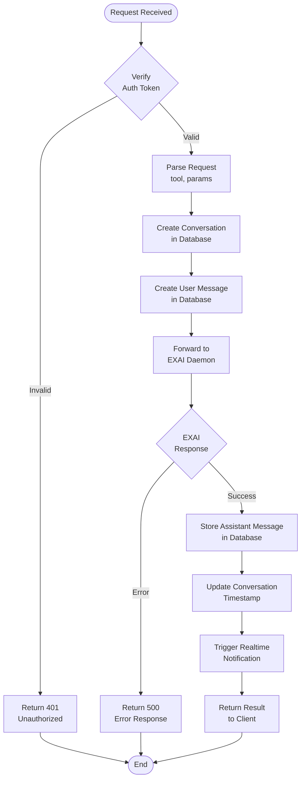
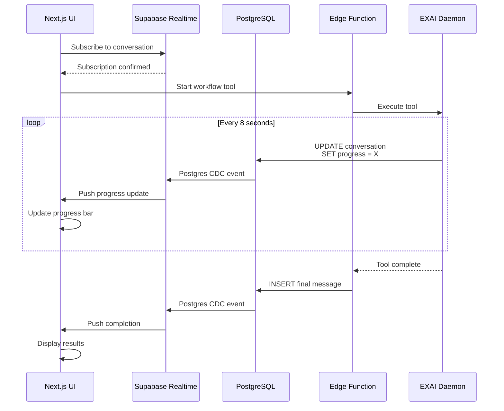
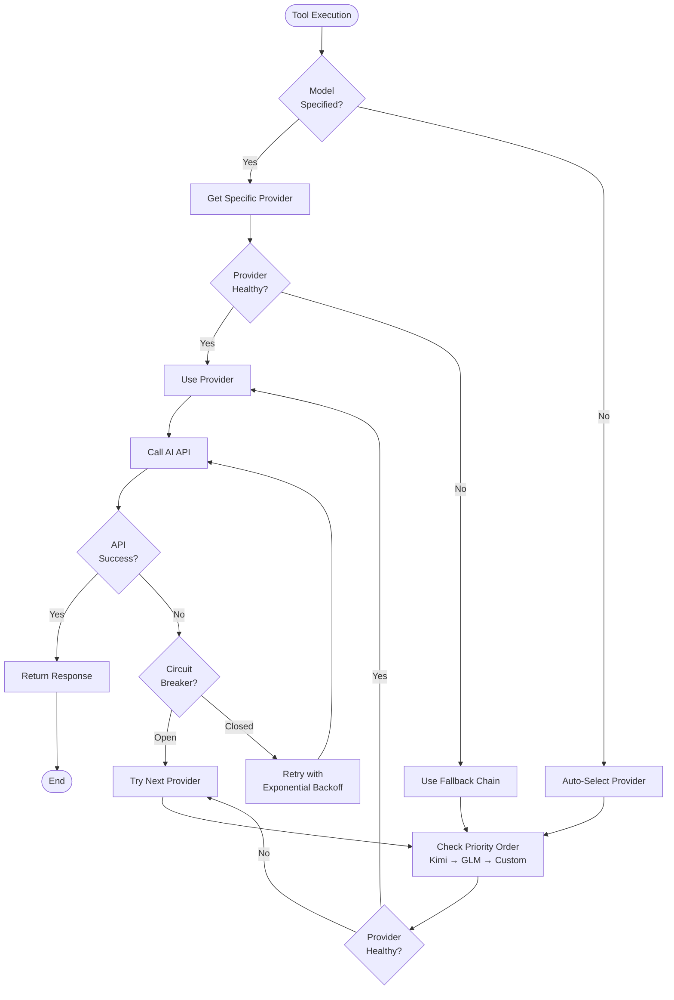
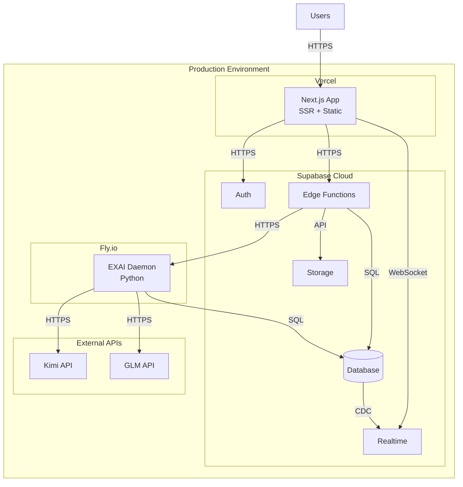
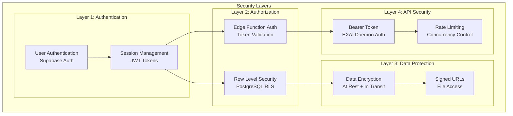
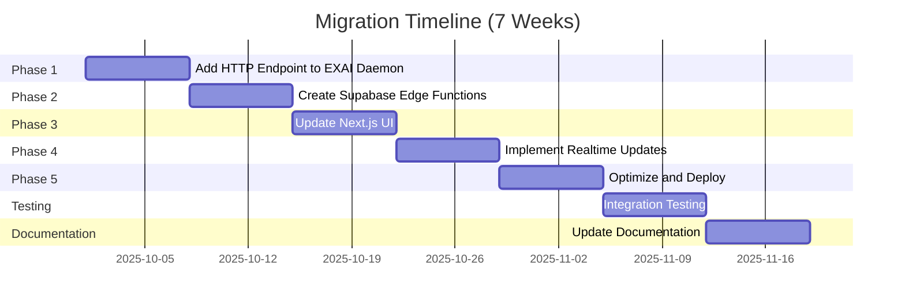

# EXAI UI MCP - Architecture Diagrams

**Version:** 2.0 - Supabase-First Hybrid  
**Last Updated:** 2025-10-01

This document provides comprehensive Mermaid diagrams for the new Supabase-First Hybrid architecture.

---

## 1. System Architecture Overview



---

## 2. Request Flow Sequence



---

## 3. EXAI Daemon Architecture



---

## 4. Database Schema

```mermaid
erDiagram
    USER ||--o{ CONVERSATION : creates
    USER ||--o{ FILE : uploads
    USER ||--o{ USER_SETTINGS : has
    USER ||--o{ SESSION : has
    
    CONVERSATION ||--o{ MESSAGE : contains
    CONVERSATION ||--o{ WORKFLOW : has
    CONVERSATION ||--o{ FILE : references
    
    WORKFLOW ||--o{ WORKFLOW_STEP : contains
    
    MESSAGE ||--o{ MESSAGE_ATTACHMENT : has
    FILE ||--o{ MESSAGE_ATTACHMENT : referenced_by
    
    USER {
        uuid id PK
        string email UK
        string name
        string password
        enum role
        timestamp created_at
        timestamp updated_at
    }
    
    CONVERSATION {
        uuid id PK
        uuid user_id FK
        string title
        string tool_type
        timestamp created_at
        timestamp updated_at
    }
    
    MESSAGE {
        uuid id PK
        uuid conversation_id FK
        enum role
        text content
        jsonb metadata
        timestamp created_at
    }
    
    WORKFLOW {
        uuid id PK
        uuid conversation_id FK
        string tool_type
        enum status
        int current_step
        int total_steps
        string continuation_id
        jsonb result
        timestamp created_at
        timestamp updated_at
    }
    
    WORKFLOW_STEP {
        uuid id PK
        uuid workflow_id FK
        int step_number
        text findings
        text hypothesis
        enum confidence
        enum status
        jsonb metadata
        timestamp created_at
    }
    
    FILE {
        uuid id PK
        uuid user_id FK
        uuid conversation_id FK
        uuid workflow_step_id FK
        string name
        int size
        string type
        string url
        timestamp created_at
    }
    
    USER_SETTINGS {
        uuid id PK
        uuid user_id FK UK
        string default_model
        string default_thinking_mode
        boolean web_search_enabled
        string theme
        jsonb preferences
    }
    
    SESSION {
        uuid id PK
        string session_token UK
        uuid user_id FK
        timestamp expires
    }
    
    MESSAGE_ATTACHMENT {
        uuid id PK
        uuid message_id FK
        uuid file_id FK
    }
```

---

## 5. Edge Function Gateway Flow



---

## 6. Realtime Progress Updates



---

## 7. Provider Selection Flow



---

## 8. Deployment Architecture



---

## 9. Security Architecture



---

## 10. Migration Phases



---

**For detailed implementation guidance, see:**
- [Supabase-Native Architecture](./SUPABASE-NATIVE-ARCHITECTURE.md)
- [Migration Strategy](./MIGRATION-STRATEGY.md)
- [Deployment Guide](./DEPLOYMENT-GUIDE.md)

