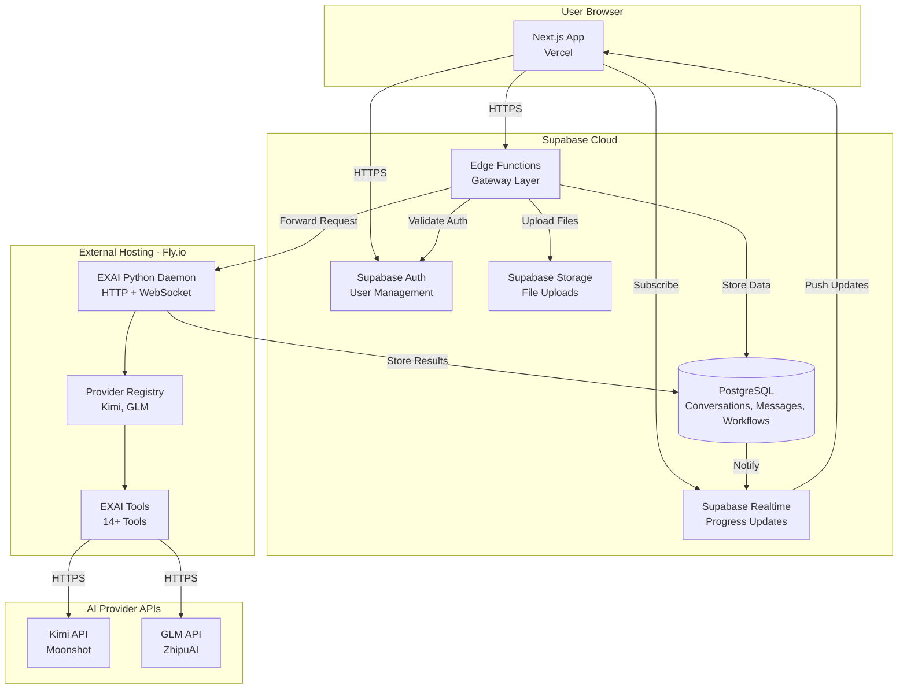
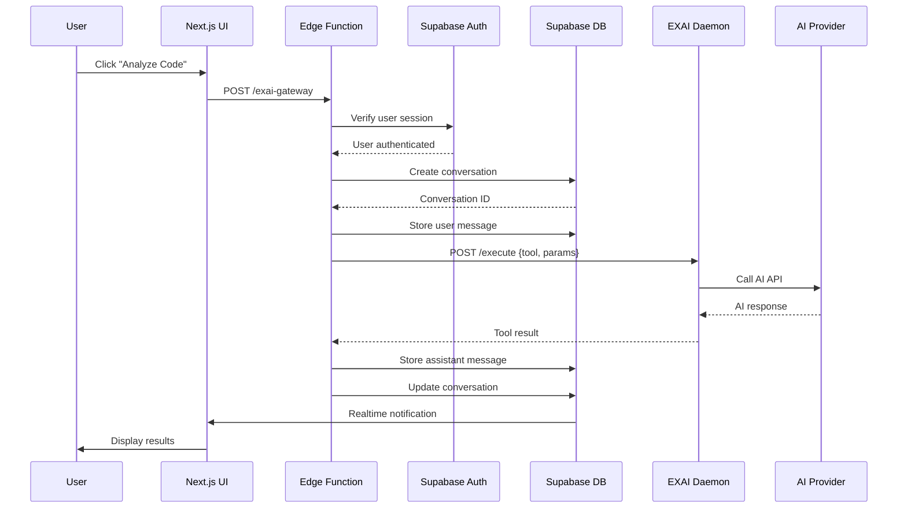

# EXAI UI MCP - Supabase-Native Architecture

## Executive Summary

After comprehensive investigation of the EXAI system architecture and Supabase capabilities, we've determined that a **pure Supabase-native implementation is NOT FEASIBLE**. Instead, we recommend a **"Supabase-First Hybrid" architecture** that maximizes Supabase integration while preserving the EXAI Python codebase.

## Key Findings

### Critical Incompatibilities

1. **Runtime Mismatch**
   - EXAI: Python 3.x with async I/O (asyncio, websockets)
   - Supabase Edge Functions: Deno runtime (TypeScript/JavaScript only)
   - **Verdict:** Cannot run Python code in Edge Functions

2. **WebSocket Server Requirement**
   - EXAI: Full WebSocket server (RFC 6455) with JSON-RPC 2.0
   - Supabase: Realtime is pub/sub only, not full WebSocket server
   - **Verdict:** Cannot replace WebSocket daemon with Realtime

3. **Stateful Provider Registry**
   - EXAI: Singleton pattern with shared state (circuit breaker, health monitoring)
   - Supabase Edge Functions: Stateless, no shared memory
   - **Verdict:** Cannot implement provider registry in Edge Functions

4. **Execution Time Limits**
   - EXAI Workflow Tools: Can run for minutes (complex analysis, debugging)
   - Supabase Edge Functions: 150-second limit
   - **Verdict:** May be insufficient for complex workflows

5. **Concurrency Control**
   - EXAI: Bounded semaphores (24 global, 8 per-session, 6 Kimi, 4 GLM)
   - Supabase: No built-in rate limiting/semaphore mechanisms
   - **Verdict:** Requires custom implementation

### Supabase Strengths

1. **Authentication:** Robust user auth with RLS policies
2. **Database:** PostgreSQL with real-time subscriptions
3. **Storage:** File storage with RLS and signed URLs
4. **Realtime:** Perfect for progress notifications and UI updates
5. **Edge Functions:** Excellent for lightweight gateway/proxy layer

---

## Recommended Architecture: "Supabase-First Hybrid"

### Architecture Diagram

### Data Flow

### Component Responsibilities

| Component | Responsibilities | Technology |
|-----------|-----------------|------------|
| **Next.js UI** | User interface, interaction, display | React, TypeScript, Tailwind |
| **Supabase Auth** | User authentication, session management | Supabase Auth |
| **Supabase Database** | Persist conversations, messages, workflows | PostgreSQL 17 |
| **Supabase Storage** | Store uploaded files, attachments | Supabase Storage |
| **Supabase Realtime** | Push progress updates to UI | Postgres CDC |
| **Edge Functions** | Gateway, auth validation, request routing | Deno, TypeScript |
| **EXAI Daemon** | Tool execution, provider management | Python, aiohttp |
| **Provider Registry** | Health monitoring, provider selection | Python, singleton |
| **EXAI Tools** | 14+ specialized AI workflows | Python, async |

---

## Architecture Benefits

### User Experience
- ✅ Users log into Supabase-hosted web app
- ✅ No local daemon setup required
- ✅ Real-time progress updates
- ✅ Persistent conversation history
- ✅ File uploads and management

### Developer Experience
- ✅ Preserves existing EXAI Python codebase (2000+ lines)
- ✅ No massive rewrite to TypeScript needed
- ✅ Incremental migration path
- ✅ Clear separation of concerns
- ✅ Easy to test and debug

### Operational Benefits
- ✅ Minimal external hosting (single Python service)
- ✅ Supabase handles scaling for auth/database
- ✅ EXAI daemon can scale independently
- ✅ Clear monitoring and logging
- ✅ Cost-effective (~$30-75/month)

### Security
- ✅ Supabase RLS policies for multi-tenant data
- ✅ Edge Functions validate all requests
- ✅ EXAI daemon behind authentication
- ✅ No direct user access to EXAI daemon
- ✅ Secure file storage with signed URLs

---

## Trade-offs

### What We Gain
- ✅ Supabase integration (auth, database, storage, realtime)
- ✅ Preserved EXAI capabilities (all 14+ tools)
- ✅ Real-time UI updates
- ✅ Scalable architecture
- ✅ Secure multi-tenant system

### What We Accept
- ⚠️ Still requires external Python hosting (Fly.io)
- ⚠️ HTTP request/response instead of WebSocket (acceptable)
- ⚠️ Edge Functions add ~50-100ms latency (minimal)
- ⚠️ Two deployment targets (Vercel + Fly.io)

---

## Alternative Approaches Considered

### Option A: Full TypeScript Rewrite
**Description:** Rewrite entire EXAI system in TypeScript for Edge Functions

**Pros:**
- Pure Supabase-native
- No external hosting needed
- Single deployment target

**Cons:**
- ❌ Massive effort (2000+ lines of Python)
- ❌ High risk of bugs during rewrite
- ❌ Loss of existing EXAI ecosystem
- ❌ 3-6 months development time
- ❌ May still hit 150-second Edge Function limit

**Verdict:** REJECTED - Too risky, too expensive, too time-consuming

### Option B: AWS Lambda for Python
**Description:** Use AWS Lambda Python runtime instead of Fly.io

**Pros:**
- Serverless Python execution
- Auto-scaling
- Pay-per-use pricing

**Cons:**
- ❌ Cold start latency (1-5 seconds)
- ❌ 15-minute execution limit (may not be enough)
- ❌ More complex deployment
- ❌ Higher cost at scale

**Verdict:** POSSIBLE - But Fly.io is simpler and more cost-effective

### Option C: Supabase + Python Edge Runtime
**Description:** Wait for Supabase to support Python Edge Functions

**Pros:**
- Would enable pure Supabase-native
- No external hosting

**Cons:**
- ❌ Not currently available
- ❌ No timeline for Python support
- ❌ Uncertain if it will ever happen

**Verdict:** NOT VIABLE - Cannot wait for uncertain future feature

---

## Recommended Approach: Supabase-First Hybrid

This architecture provides the best balance of:
- **User Experience:** Supabase-hosted app with real-time updates
- **Developer Experience:** Preserved Python codebase
- **Operational Simplicity:** Minimal external hosting
- **Cost Effectiveness:** ~$30-75/month
- **Scalability:** Independent scaling of components
- **Security:** Multi-tenant with RLS policies

**Next Steps:** See [Migration Strategy](./MIGRATION-STRATEGY.md) for implementation plan.

