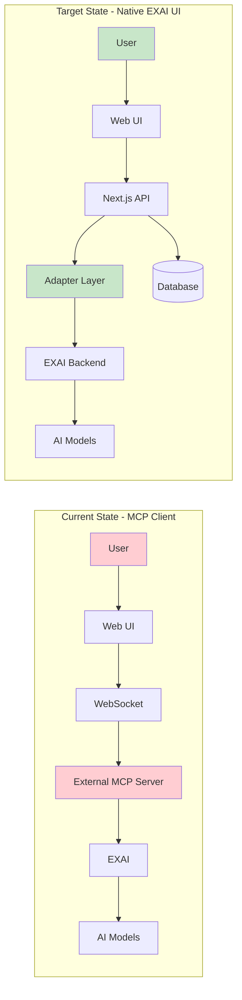
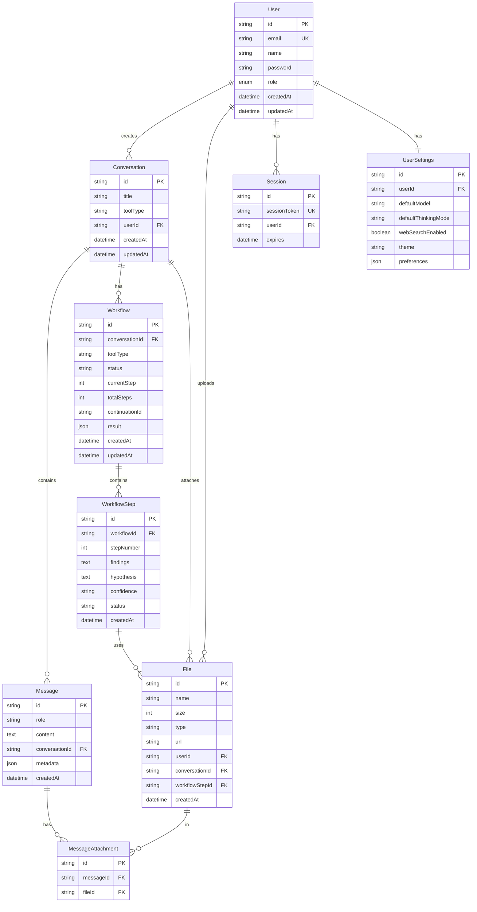
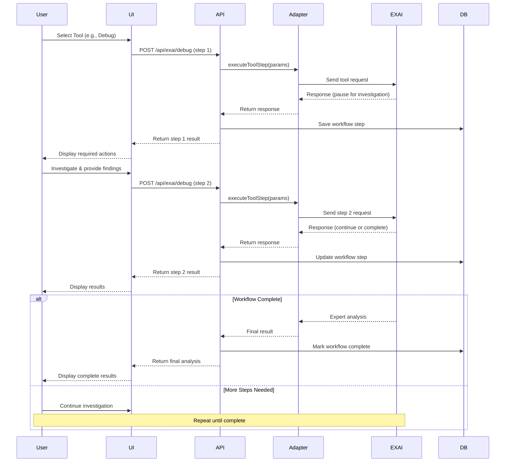
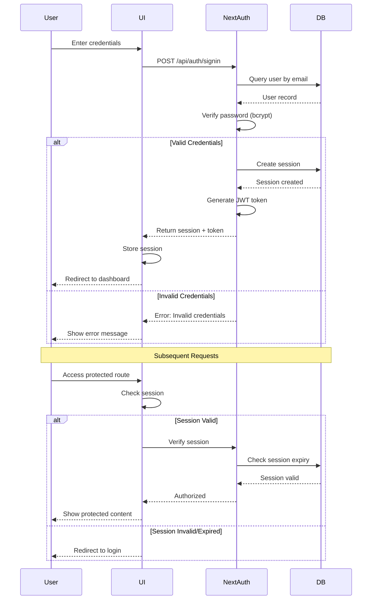
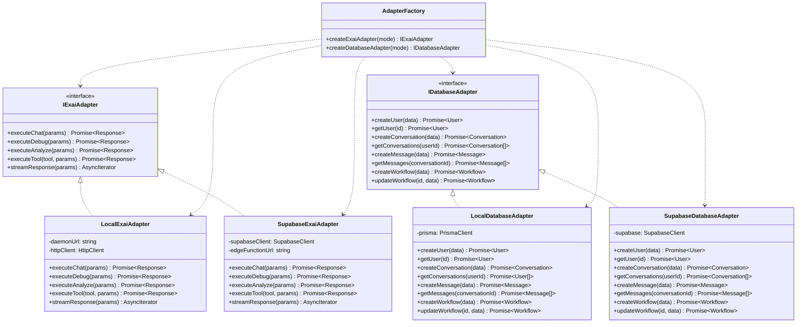
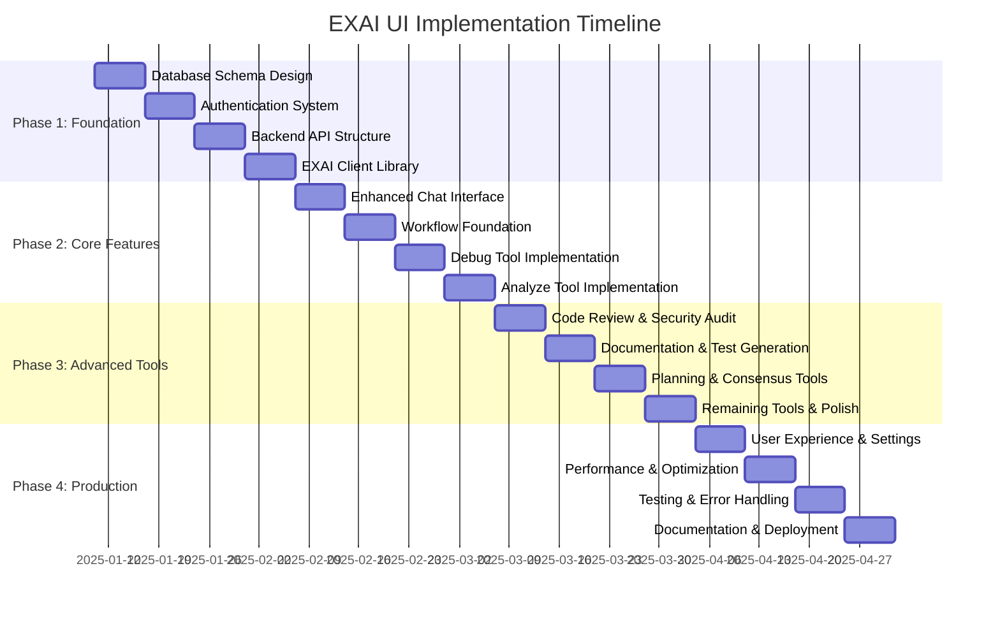
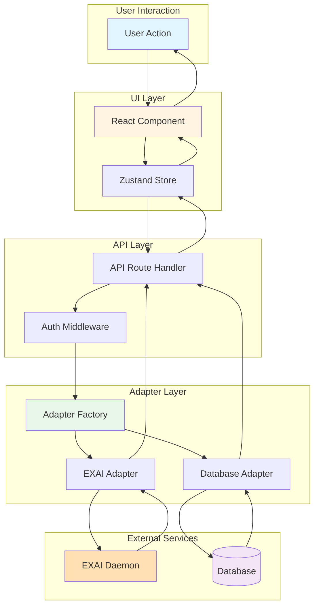
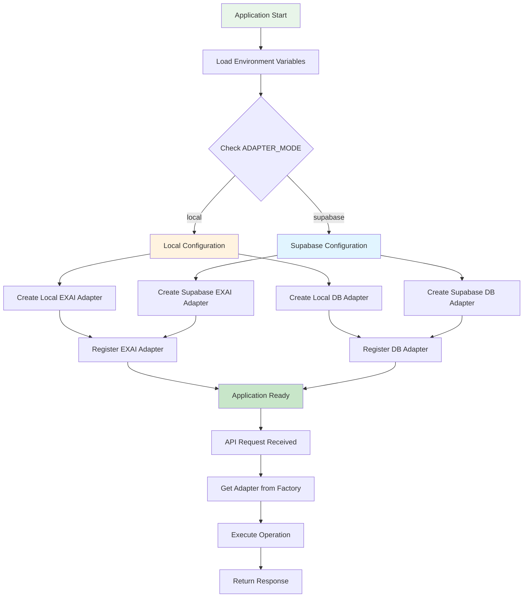

# EXAI UI MCP - Visual Architecture Guide

This document provides visual representations of the project architecture using Mermaid diagrams.

## Table of Contents
1. [System Architecture Overview](#system-architecture-overview)
2. [Current vs Target State](#current-vs-target-state)
3. [Database Schema](#database-schema)
4. [API Route Structure](#api-route-structure)
5. [EXAI Tools Workflow](#exai-tools-workflow)
6. [Authentication Flow](#authentication-flow)
7. [Adapter Pattern Architecture](#adapter-pattern-architecture)
8. [Implementation Phases](#implementation-phases)

---

## System Architecture Overview

```mermaid
graph TB
    subgraph "Client Layer"
        Browser[Web Browser]
        Mobile[Mobile App - Future]
        VSCode[VS Code Extension - Future]
    end
    
    subgraph "Next.js Application"
        subgraph "Frontend"
            UI[React UI Components]
            State[State Management - Zustand]
            WS[WebSocket Client]
        end
        
        subgraph "API Routes"
            AuthAPI[/api/auth/*]
            ExaiAPI[/api/exai/*]
            ConvAPI[/api/conversations/*]
            FileAPI[/api/files/*]
            UserAPI[/api/users/*]
        end
        
        subgraph "Adapters"
            ExaiAdapter[EXAI Adapter Interface]
            DBAdapter[Database Adapter Interface]
            LocalExai[Local EXAI Adapter]
            SupabaseExai[Supabase EXAI Adapter - Future]
            LocalDB[Local PostgreSQL Adapter]
            SupabaseDB[Supabase Adapter - Future]
        end
    end
    
    subgraph "Data Layer"
        Postgres[(PostgreSQL Database)]
        Supabase[(Supabase - Future)]
    end
    
    subgraph "EXAI Backend"
        ExaiDaemon[EXAI Daemon Server<br/>127.0.0.1:8765]
        ExaiTools[EXAI Tools<br/>14+ Specialized Tools]
        AIModels[AI Models<br/>GLM, Kimi, DeepSeek, etc.]
    end
    
    Browser --> UI
    Mobile -.-> UI
    VSCode -.-> UI
    
    UI --> State
    UI --> WS
    UI --> AuthAPI
    UI --> ExaiAPI
    UI --> ConvAPI
    UI --> FileAPI
    UI --> UserAPI
    
    AuthAPI --> DBAdapter
    ConvAPI --> DBAdapter
    FileAPI --> DBAdapter
    UserAPI --> DBAdapter
    
    ExaiAPI --> ExaiAdapter
    
    ExaiAdapter --> LocalExai
    ExaiAdapter -.-> SupabaseExai
    
    DBAdapter --> LocalDB
    DBAdapter -.-> SupabaseDB
    
    LocalDB --> Postgres
    SupabaseDB -.-> Supabase
    
    LocalExai --> ExaiDaemon
    SupabaseExai -.-> Supabase
    
    ExaiDaemon --> ExaiTools
    ExaiTools --> AIModels
    
    WS --> ExaiDaemon
    
    style Browser fill:#e1f5ff
    style UI fill:#fff4e1
    style ExaiAdapter fill:#e8f5e9
    style DBAdapter fill:#e8f5e9
    style Postgres fill:#f3e5f5
    style ExaiDaemon fill:#ffe0b2
```

---

## Current vs Target State



---

## Database Schema



---

## API Route Structure

```mermaid
graph TD
    API[API Routes /api]
    
    API --> Auth[/auth]
    API --> EXAI[/exai]
    API --> Conv[/conversations]
    API --> Files[/files]
    API --> Users[/users]
    API --> Workflows[/workflows]
    API --> Admin[/admin]
    
    Auth --> NextAuth[/[...nextauth]]
    
    EXAI --> Chat[/chat]
    EXAI --> Debug[/debug]
    EXAI --> Analyze[/analyze]
    EXAI --> CodeReview[/codereview]
    EXAI --> SecAudit[/secaudit]
    EXAI --> DocGen[/docgen]
    EXAI --> TestGen[/testgen]
    EXAI --> Planner[/planner]
    EXAI --> Consensus[/consensus]
    EXAI --> Precommit[/precommit]
    EXAI --> Refactor[/refactor]
    EXAI --> Tracer[/tracer]
    EXAI --> Challenge[/challenge]
    EXAI --> ThinkDeep[/thinkdeep]
    
    Conv --> ConvList[GET /]
    Conv --> ConvCreate[POST /]
    Conv --> ConvDetail[/[id]]
    ConvDetail --> ConvGet[GET]
    ConvDetail --> ConvUpdate[PUT]
    ConvDetail --> ConvDelete[DELETE]
    ConvDetail --> Messages[/messages]
    
    Files --> FileUpload[POST /]
    Files --> FileDetail[/[id]]
    FileDetail --> FileGet[GET]
    FileDetail --> FileDelete[DELETE]
    
    Users --> Me[/me]
    Me --> Profile[GET /]
    Me --> Settings[/settings]
    
    Workflows --> WorkflowList[GET /]
    Workflows --> WorkflowDetail[/[id]]
    WorkflowDetail --> WorkflowGet[GET]
    WorkflowDetail --> WorkflowUpdate[PUT]
    WorkflowDetail --> Steps[/steps]
    
    Admin --> AdminUsers[/users]
    Admin --> Analytics[/analytics]
    
    style API fill:#e3f2fd
    style EXAI fill:#fff3e0
    style Auth fill:#f3e5f5
```

---

## EXAI Tools Workflow



---

## Authentication Flow



---

## Adapter Pattern Architecture



---

## Implementation Phases



---

## Component Interaction Flow



---

## Configuration-Based Adapter Selection



---

This visual guide provides a comprehensive overview of the EXAI UI MCP architecture using Mermaid diagrams. All diagrams are interactive and can be rendered in any Markdown viewer that supports Mermaid.

