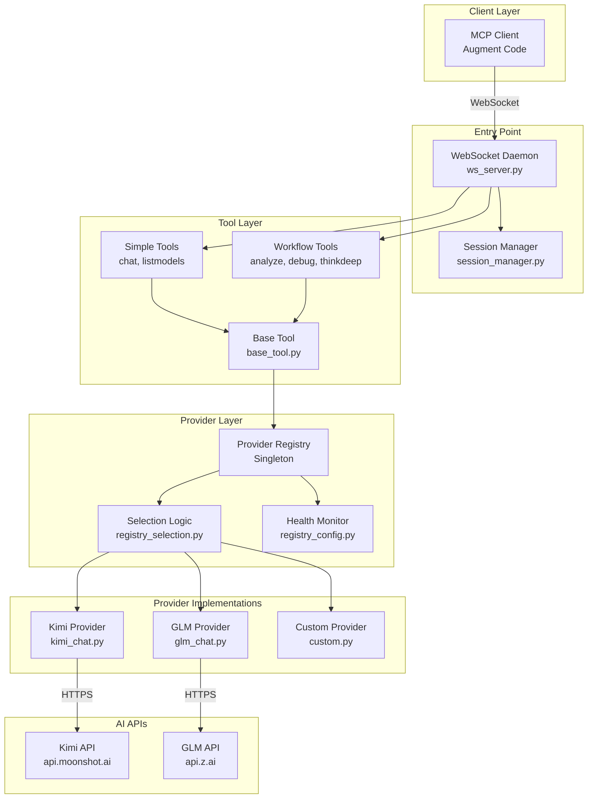
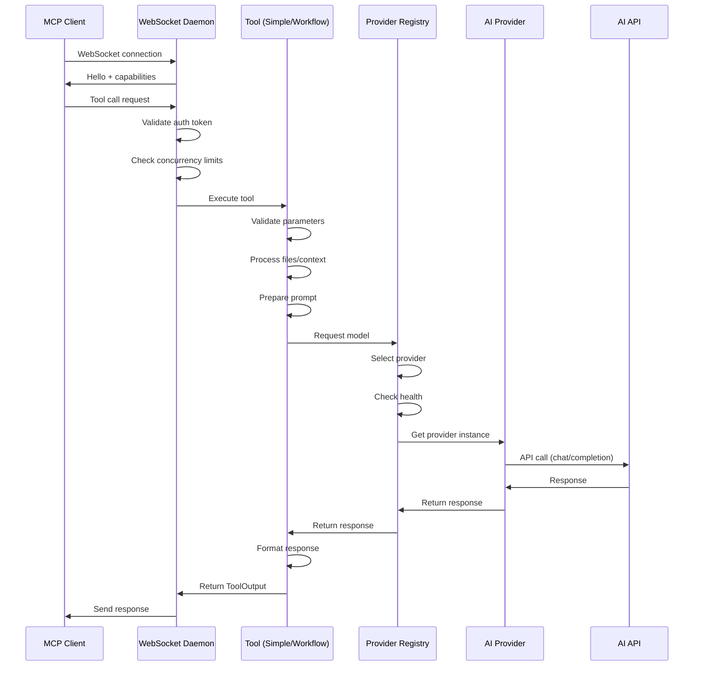
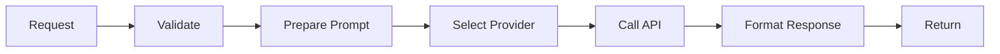
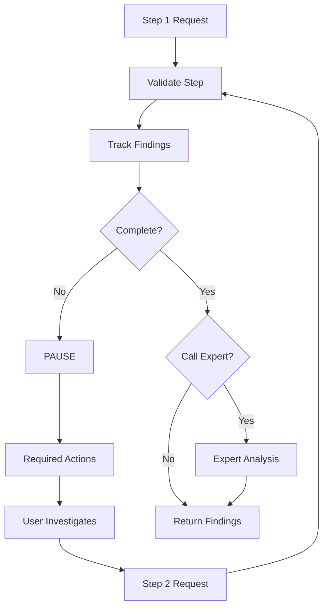
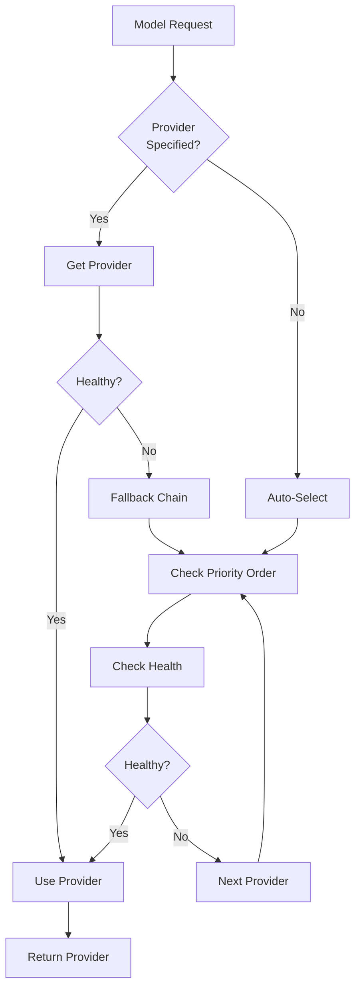

# EX-AI-MCP-Server: System Architecture Overview

**Version:** 2.0.0  
**Last Updated:** 2025-10-01  
**Author:** Zazzles  
**Purpose:** Comprehensive system architecture documentation with diagrams

---

## 🎯 System Overview

EX-AI-MCP-Server is a **WebSocket-based MCP (Model Context Protocol) daemon** that provides AI model integration for international users. It routes requests to multiple AI providers (Kimi, GLM) with intelligent fallback, health monitoring, and workflow enforcement.

**Key Characteristics:**
- **Architecture:** WebSocket daemon with provider registry pattern
- **Target Users:** International users (api.z.ai, NOT mainland China)
- **Primary Providers:** Kimi (Moonshot), GLM (ZhipuAI)
- **Tool Types:** Simple tools (request/response) + Workflow tools (multi-step)
- **Scalability:** Stateless tools, singleton registry, bounded concurrency

---

## 📊 High-Level System Components



---

## 🔄 Request Flow: End-to-End



---

## 🏗️ Component Details

### 1. WebSocket Daemon (Entry Point)

**File:** `src/daemon/ws_server.py` (888 lines)

**Responsibilities:**
- Accept WebSocket connections from MCP clients
- Authenticate using `EXAI_WS_TOKEN`
- Route tool calls to appropriate tool implementations
- Manage concurrency limits (global, per-session, per-provider)
- Handle session lifecycle and cleanup
- Provide health monitoring and metrics

**Key Features:**
- **Concurrency Control:** Bounded semaphores prevent overload
  - Global: 24 concurrent calls
  - Per-session: 8 concurrent calls
  - Kimi: 6 concurrent calls
  - GLM: 4 concurrent calls
- **Result Caching:** Semantic key-based caching (survives reconnects)
- **Progress Heartbeats:** 8-second intervals during long operations
- **Graceful Shutdown:** Signal handling for clean termination

**Configuration:**
```python
EXAI_WS_HOST = "127.0.0.1"
EXAI_WS_PORT = 8765
EXAI_WS_TOKEN = "secret-token"
EXAI_WS_MAX_BYTES = 32MB
CALL_TIMEOUT = 90 seconds
```

---

### 2. Provider Registry (Core Infrastructure)

**Files:**
- `src/providers/registry_core.py` - Core registry (504 lines)
- `src/providers/registry_selection.py` - Selection logic (496 lines)
- `src/providers/registry_config.py` - Health monitoring

**Pattern:** Singleton with thread-safe initialization

**Responsibilities:**
- Register and initialize providers
- Select appropriate provider for each request
- Monitor provider health (circuit breaker pattern)
- Track telemetry (success/failure, latency, tokens)
- Provide fallback chains for reliability

**Provider Priority Order:**
```python
PROVIDER_PRIORITY_ORDER = [
    ProviderType.KIMI,      # Direct Kimi/Moonshot (preferred)
    ProviderType.GLM,       # Direct GLM/ZhipuAI (preferred)
    ProviderType.CUSTOM,    # Local/self-hosted models
    ProviderType.OPENROUTER # Catch-all for cloud models
]
```

**Selection Strategy:**
1. Check provider health (circuit breaker state)
2. Filter models by provider availability
3. Apply cost-aware ordering (free-tier first)
4. Ask provider for preference
5. Fallback to next provider if unavailable

**Health Monitoring:**
- **Circuit States:** CLOSED (healthy), OPEN (failing), HALF_OPEN (testing)
- **Failure Threshold:** 5 consecutive failures → OPEN
- **Recovery:** After cooldown, test with single request
- **Metrics:** Success rate, latency, token usage

---

### 3. Tool Architecture

#### 3.1 Base Tool (Foundation)

**File:** `tools/shared/base_tool.py` (119 lines)

**Composition Pattern:**
```python
class BaseTool(
    BaseToolCore,              # Core interface
    ModelManagementMixin,      # Model provider integration
    FileHandlingMixin,         # File processing
    ResponseFormattingMixin,   # Response formatting
    ABC
):
    pass
```

**Key Features:**
- **Conversation-Aware File Processing:** Deduplication with newest-first priority
- **Token-Aware Embedding:** Respects model token limits
- **Stateless-to-Stateful Bridging:** Continuation IDs for conversation memory
- **Cross-Tool Knowledge Transfer:** Files from previous tools accessible

---

#### 3.2 Simple Tools (Request/Response)

**File:** `tools/simple/base.py` (1,184 lines)

**Pattern:** Template Method

**Workflow:**
```python
class SimpleTool(BaseTool):
    def execute(self, request):
        # 1. Receive request
        # 2. Prepare prompt
        prompt = self.prepare_prompt(request)
        # 3. Call AI model
        response = self.call_model(prompt)
        # 4. Format response
        return self.format_response(response)
```

**Examples:**
- `chat` - General conversation
- `listmodels` - List available models
- `version` - Server version info

**Characteristics:**
- Single request/response cycle
- No state between calls
- Fast execution
- Simple error handling

---

#### 3.3 Workflow Tools (Multi-Step)

**File:** `tools/workflow/base.py` (571 lines)

**Pattern:** Template Method + State Machine

**Workflow:**
```python
class WorkflowTool(BaseTool, BaseWorkflowMixin):
    def execute(self, request):
        # 1. Validate step progression
        # 2. Track findings and progress
        # 3. PAUSE - Force investigation
        # 4. Repeat until complete
        # 5. Call expert analysis (optional)
        # 6. Return comprehensive results
```

**Examples:**
- `analyze` - Code analysis
- `debug` - Root cause investigation
- `thinkdeep` - Deep reasoning
- `codereview` - Code review
- `precommit` - Pre-commit validation

**Key Features:**
- **Pause-for-Investigation:** Enforces evidence-based methodology
- **Required Actions:** Specifies what to investigate next
- **Consolidated Findings:** Tracks progress across steps
- **Expert Analysis:** Optional AI validation at completion
- **Confidence Tracking:** Monitors investigation confidence

**Why Pause-Based?**
- Prevents hallucination
- Ensures evidence-based conclusions
- Enforces systematic methodology
- Builds user trust
- Enables verification

---

## 🔀 Data Flow Patterns

### Pattern #1: Simple Tool Flow



**Characteristics:**
- Linear flow
- Single API call
- Fast execution
- Stateless

---

### Pattern #2: Workflow Tool Flow



**Characteristics:**
- Multi-step flow
- State tracking
- Enforced pauses
- Evidence-based
- Optional expert validation

---

### Pattern #3: Provider Selection Flow



**Characteristics:**
- Intelligent routing
- Health-aware
- Automatic fallback
- Priority-based

---

## 🔌 Integration Points

### 1. MCP Client ↔ WebSocket Daemon

**Protocol:** WebSocket (RFC 6455)  
**Format:** JSON-RPC 2.0  
**Authentication:** Bearer token in hello message

**Message Types:**
- `hello` - Initial handshake
- `call_tool` - Tool invocation
- `ping/pong` - Keep-alive
- `result` - Tool response
- `error` - Error response

---

### 2. Tool ↔ Provider Registry

**Interface:** Python method calls  
**Pattern:** Dependency injection

**Key Methods:**
```python
# Get provider instance
provider = ModelProviderRegistry.get_provider(ProviderType.KIMI)

# Select best provider for category
model = registry.get_best_provider_for_category(ToolModelCategory.FAST_RESPONSE)

# Call with fallback
response = registry.call_with_fallback(messages, model, **kwargs)
```

---

### 3. Provider ↔ AI API

**Protocol:** HTTPS REST  
**Format:** JSON  
**Authentication:** API key in headers

**Kimi API:**
```python
base_url = "https://api.moonshot.ai/v1"
headers = {"Authorization": f"Bearer {MOONSHOT_API_KEY}"}
```

**GLM API:**
```python
base_url = "https://api.z.ai/api/paas/v4"
headers = {"Authorization": f"Bearer {ZHIPUAI_API_KEY}"}
```

---

## 📈 Scalability Considerations

### Horizontal Scalability

**Current State:**
- ✅ Stateless tools enable parallel execution
- ✅ Singleton registry is thread-safe
- ✅ Bounded concurrency prevents overload
- ⚠️ In-memory caching limits multi-instance deployment

**Future Improvements:**
- Add Redis for distributed caching
- Add database for persistent telemetry
- Add load balancer for multiple daemon instances

---

### Vertical Scalability

**Current State:**
- ✅ Async I/O for concurrent requests
- ✅ Bounded semaphores prevent resource exhaustion
- ✅ Circuit breakers prevent cascade failures
- ✅ Result caching reduces API calls

**Bottlenecks:**
- API rate limits (provider-specific)
- Network latency to AI APIs
- Large file processing (token limits)

---

### Performance Characteristics

**Latency:**
- Simple tools: 1-5 seconds (API latency)
- Workflow tools: Variable (depends on steps)
- Cached results: <100ms

**Throughput:**
- Global: 24 concurrent calls
- Per-session: 8 concurrent calls
- Kimi: 6 concurrent calls
- GLM: 4 concurrent calls

**Resource Usage:**
- Memory: ~100MB base + ~10MB per active session
- CPU: Low (I/O bound)
- Network: High (API calls)

---

## 🔒 Security Architecture

### Authentication

**WebSocket Level:**
- Bearer token authentication
- Token in `EXAI_WS_TOKEN` environment variable
- Validated on connection

**API Level:**
- Provider API keys in environment variables
- Never exposed to clients
- Rotatable without code changes

---

### Input Validation

**File Paths:**
- Must be absolute paths
- Validated before processing
- Prevents directory traversal

**Parameters:**
- Type checking via Pydantic models
- Range validation (temperature, tokens)
- Enum validation (model names, categories)

---

### Error Handling

**Strategy:** Fail fast with clear messages

**Levels:**
1. **Input Validation:** Catch errors early
2. **Provider Errors:** Graceful degradation with fallback
3. **API Errors:** Retry with exponential backoff
4. **System Errors:** Log and return user-friendly message

---

## 🎯 Summary

### Architecture Strengths

1. **Modularity:** Clear separation of concerns
2. **Reliability:** Health monitoring + fallback chains
3. **Scalability:** Stateless tools + bounded concurrency
4. **Maintainability:** Well-documented, type-hinted code
5. **Extensibility:** Easy to add providers/tools

### Key Patterns

1. **Singleton Registry:** Provider management
2. **Strategy Pattern:** Interchangeable providers
3. **Template Method:** Tool workflows
4. **Circuit Breaker:** Health monitoring
5. **Bounded Semaphore:** Concurrency control

### Design Philosophy Alignment

- ✅ **Simplicity:** Clear component boundaries
- ✅ **Evidence-Based:** Workflow tools enforce methodology
- ✅ **User-Centric:** Clear errors, helpful defaults
- ✅ **Maintainability:** Comprehensive documentation
- ✅ **Extensibility:** Pattern-based architecture
- ✅ **Configuration:** Environment-based settings
- ✅ **Fail Fast:** Early validation, clear errors

---

**Status:** ✅ COMPLETE  
**Next:** System Prompt Audit (Task 0.3)  
**Purpose:** Foundation for understanding system architecture

